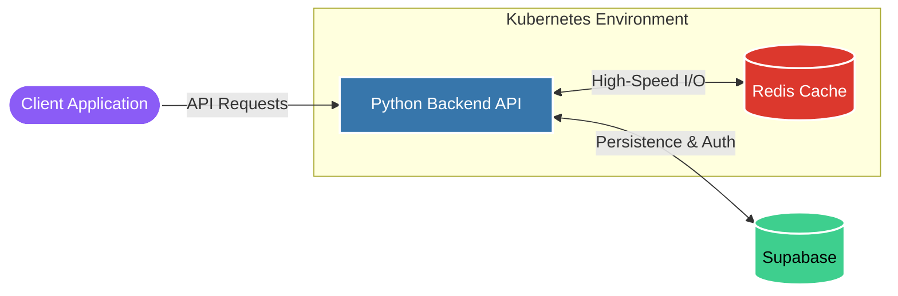

  

  

    
  

   

  

    
    
    
  

---

### 💫 About Me
I am a Software Engineer with strong foundations in programming, full-stack development, and system-level architecture. I focus on building scalable backend services, autonomous AI agents, and data-driven simulations.

- 🔭 **Currently working on:** AI Agents, Simulations, and Full Stack enterprise systems
- 🛠️ **Core Stack:** High-performance Python backends with Redis cache & Supabase
- 🌱 **Currently Learning:** Advanced Backend Architecture, Event-Driven Systems & Go (Golang)
- ⚡ **Passionate about:** Delivering reliable, clean, and production-ready code
- 📍 **Based in:** Visakhapatnam, Andhra Pradesh, India

---

### 💻 Tech Stack

| Category | Tools |
| :--- | :--- |
| **Languages** |     |
| **App & Frontend** |    |
| **Backend** |    |
| **Database** |    |
| **AI & Vision** |    |
| **Infrastructure & Tools** |       |
| **Concepts & Architecture**|     |

---

### 🏗️ Typical System Architecture

---

### 🚀 Key Projects

- **🌾 KaAgriculture**  
  *A digital agriculture platform designed to optimize farm management and data analytics.* (Feel free to update this description!)  
  **Tech:** Python, React, Supabase (Update with your actual stack!)  
  

- **👁️ VaidyaDrishti AI (Medical Scanner)**  
  *Intelligent Medical Vision Intelligence & Prescription Reader system with 12x speed improvement.*  
  **Tech:** Python, Deep Learning, Computer Vision  
  

- **📜 Certificates**  
  *Automated certificate generation and preview system for participants and events.*  
  **Tech:** Node.js, Express, Automation  
  

- **🏍️ Helmetless Biker & Number Plate Detection**  
  *Comprehensive automated system for detecting helmetless bikers and capturing their number plates using deep learning.*  
  **Tech:** Python, YOLO, OpenCV  
  

---

### 📬 Let's Connect!
*I'm always open to discussing system architecture, AI integrations, or exciting software engineering opportunities. Feel free to reach out!*

---

### 📊 GitHub Statistics & Engagement

  
   
  
   
  <picture>
    <source media="(prefers-color-scheme: dark)" srcset="https://raw.githubusercontent.com/VEERESH1219/VEERESH1219/output/github-contribution-grid-snake-dark.svg">
    <source media="(prefers-color-scheme: light)" srcset="https://raw.githubusercontent.com/VEERESH1219/VEERESH1219/output/github-contribution-grid-snake.svg">
    
  </picture>
   
  

    
  

---

  

